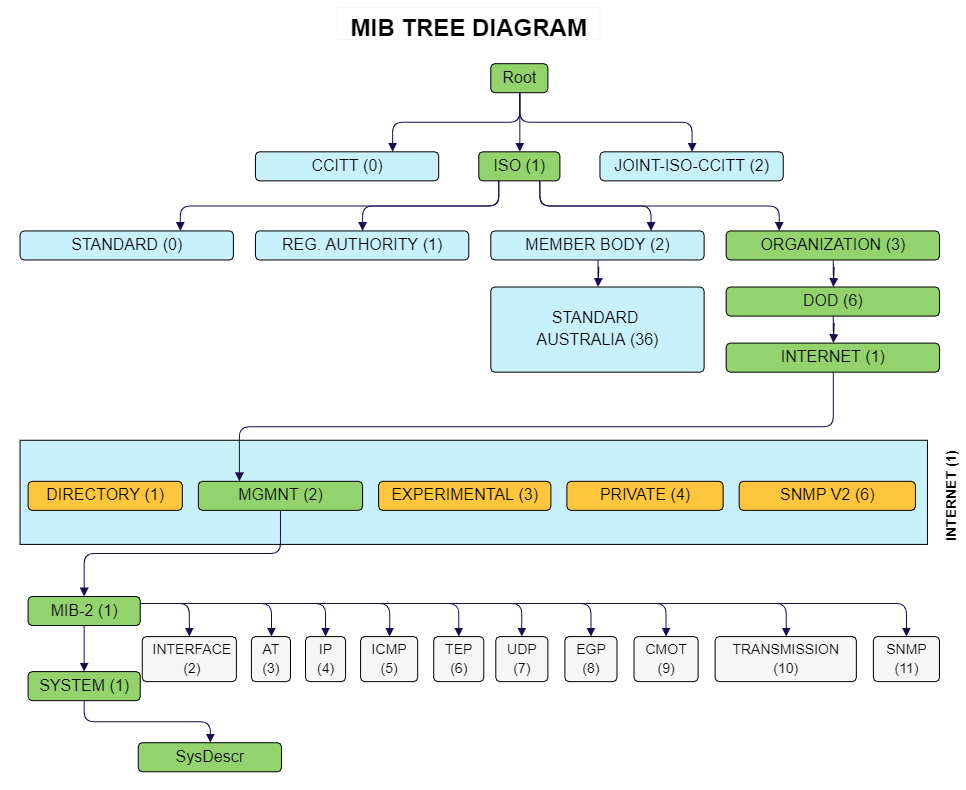

# How to Install Libraries MIB's and Run SNMP Module

Python's SNMP (Simple Network Management Protocol) module has tools that can be useful for our project, among them is the `snmpwalk` module. With this module we can read information from devices on the network using protocols versions 1 and 2 (authentication is required to read information from systems with version 3 of the protocol). With this information, we can identify various details about an SNMP-enabled device. Here is an example of some information:

```text
SNMPv2-MIB::sysDescr.0 = RouterOS CCR1009-7G-1C-1S+
SNMPv2-MIB::sysObjectID.0 = SNMPv2-SMI::enterprises.14988.1
SNMPv2-MIB::sysUpTime.0 = 531108500
SNMPv2-MIB::sysContact.0 =
SNMPv2-MIB::sysName.0 = CGNAT - BORDA FIBERNET
SNMPv2-MIB::sysLocation.0 =
SNMPv2-MIB::sysServices.0 = 78
SNMPv2-SMI::mib-2.2.1.0 = 17
SNMPv2-SMI::mib-2.2.2.1.1.1 = 1
SNMPv2-SMI::mib-2.2.2.1.1.2 = 2
SNMPv2-SMI::mib-2.2.2.1.1.3 = 3
```

After conducting some scans, it is noticeable that some information is in a less readable format, like the example line:

```text
SNMPv2-SMI::mib-2.2.2.1.1.1 = 1
```

The line above can be translated as `IF-MIB::ifIndex.1`, which means a unique value for each interface. This translation can be done manually through the [Cisco website](https://snmp.cloudapps.cisco.com/Support/SNMP/do/BrowseOID.do?local=en).

However, for our analysis, it will be necessary to automate the process of obtaining and handling MIBs.

## What is a MIB

A Management Information Base (MIB) is a database of information, consisting of a tree of objects identified by object numbers (OIDs). These objects represent specific aspects of managed devices, such as configurations, performance, and status. There are various types of MIBs, including proprietary ones, but we are using the standard MIB of the module.



This is the standard diagram of the MIB we are using.

In addition to reading information, the created module also performs translation to make it easier to collect data. To perform this translation, some components are required.

## `snmptranslate`

SNMP translate is a module that accesses MIB libraries on the computer, and through the information in this library, it is possible to convert from numeric to text format, making it easier to read. However, to access these libraries, it is necessary to download them, which will be copied to the path ```/var/lib/mibs/ietf``` on the system (Linux).

## Installation of MIBs

The installation of libraries is straightforward; you only need to use the command:

```bash
sudo apt-get install snmp-mibs-downloader
```

To download the MIB downloader manager and then use the `download-mibs` command. This command will download all available MIBs for conversion. As it covers various standards, `snmp-mibs-downloader` can cover a large part of them during the download.

## Conversion Process

The conversion process is also straightforward. Since it is a module, it has some additional information, but if you need to translate only one OID, the command will be: `snmptranslate -Ta <OID>`. For example, we could get:

```bash
$ snmptranslate -Ta SNMPv2-SMI::mib-2.2.2.1.1.1
IF-MIB::ifIndex.1
```

The ```-Ta``` parameter is used to return the OID in its simplest form, only its title. There are other parameters that can be useful and can be found [in the documentation](https://www.mkssoftware.com/docs/man1/snmptranslate.1.asp).

## Module Details

Our scanning module is structured with the following files:

* `snmp-get.py`: This file is built to retrieve information from targets identified by Censys. More precisely, we identify all IP addresses identified by Censys to have the SNMP port (161) open for reading. However, not all IPs return information; some of them time out. The module is executed with:

    ```bash
    python3 snmp-get.py data.json
    ```

- `snmpwalk.py` and `translate.py`: These modules perform the scan and translation, respectively. Both are executed by `scan.py`. The `translate` module is organized so that if a value is incorrect and cannot be translated, it will be ignored.

- `scan.py`: The scan module aggregates both modules above and executes the scan using threads. When dealing with multiple IPs, the thread execution was created so that we can launch 20 scanners at once, and each time a scan is finished, another is queued so that 20 scanners are always running simultaneously.
